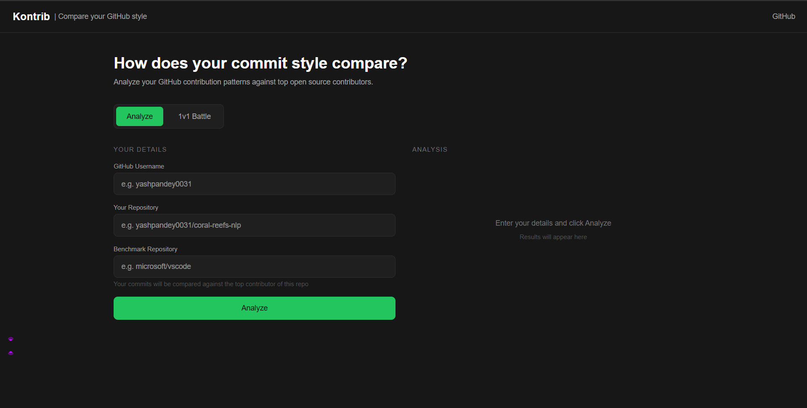
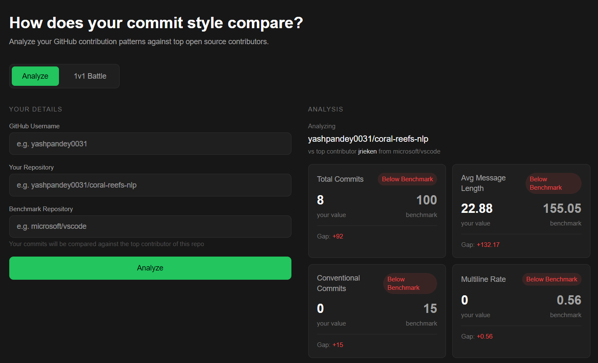
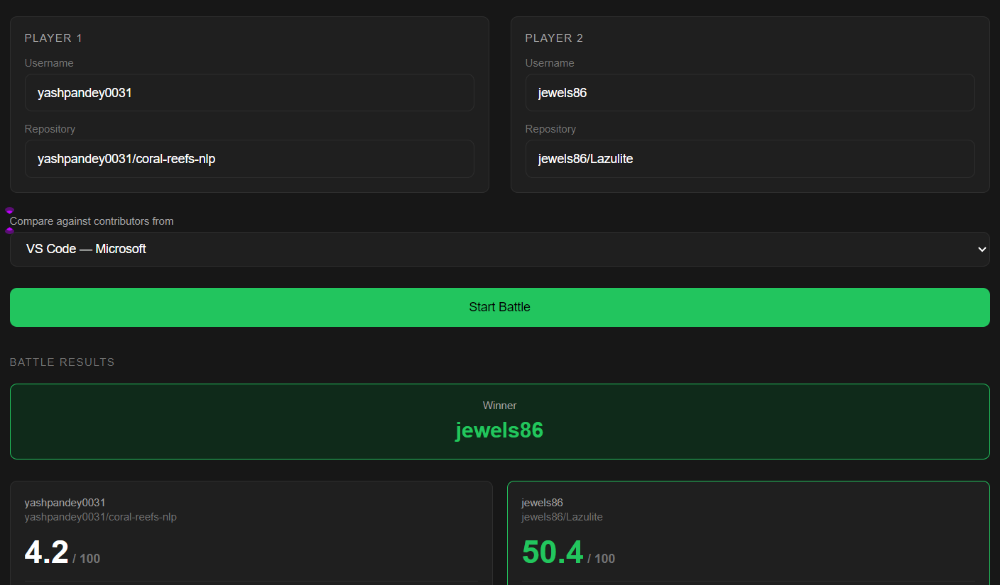

<p align="center">
  
</p>

# Kontrib

Compare your GitHub commit style against top open source contributors. Get AI-powered feedback on what separates your commits from the best in the world.



---

## What it does

**Analyze mode** — Enter your GitHub username and repo, pick a benchmark repo, and get a breakdown of how your commit style compares against the top contributor. Metrics include message length, conventional commit usage, and multiline rate — with LLM feedback grounded in real best practice docs.

**1v1 Battle mode** — Two developers go head to head. Both are scored against a composite benchmark built from the top 5 contributors of a reference repo. Highest score wins.

---

## Screenshots

| Analyze Mode                    | Battle Mode                  |
| ------------------------------- | ---------------------------- |
|  |  |

---

## Tech Stack

**Backend**

- FastAPI
- FAISS + SentenceTransformers - RAG over best practice knowledge base
- Groq (llama-3.1-8b-instant) - LLM analysis
- GitHub REST API - data fetching
- Python

**Frontend**

- React + TypeScript
- Tailwind CSS
- Vite

---

## Project Structure

```
Kontrib/
├── backend/
│   ├── main.py                  # FastAPI app entry point
│   ├── github_client.py         # GitHub API calls
│   ├── analyzer.py              # Commit signal extraction and scoring
│   ├── llm_client.py            # LLM provider (Groq default, swap via .env)
│   ├── rag_engine.py            # FAISS index over knowledge base
│   ├── routers/
│   │   └── analysis.py          # /analyze and /battle endpoints
│   └── .env                     # API keys
├── frontend/
│   └── src/
│       ├── App.tsx
│       ├── api/kontrib.ts       # API calls
│       ├── components/          # Navbar, forms, results, metrics cards
│       └── types/index.ts       # TypeScript interfaces
└── knowledge_base/              # Best practice docs for RAG
    ├── conventional_commits.md
    ├── commit_best_practices.md
    └── open_source_contribution.md
```

---

## Setup

**1. Clone the repo**

```bash
git clone https://github.com/yashpandey0031/kontrib
cd kontrib
```

**2. Backend**

```bash
cd backend
python -m venv venv
venv\Scripts\activate        # Windows
source venv/bin/activate     # Mac/Linux
pip install -r requirements.txt
```

Create `backend/.env`:

```
GITHUB_TOKEN=your_github_token
GROQ_API_KEY=your_groq_key
```

Get a free Groq key at [console.groq.com](https://console.groq.com).
Get a GitHub token at [github.com/settings/tokens](https://github.com/settings/tokens) — select `public_repo` scope.

Run:

```bash
uvicorn main:app --reload
```

**3. Frontend**

```bash
cd frontend
npm install
npm run dev
```

Open `http://localhost:5173`.

---

## LLM Configuration

Kontrib uses Groq by default (free). To swap providers, update `backend/.env` and change the provider logic in `llm_client.py`:

| Provider             | Key                 |
| -------------------- | ------------------- |
| Groq (default, free) | `GROQ_API_KEY`      |
| OpenAI               | `OPENAI_API_KEY`    |
| Anthropic            | `ANTHROPIC_API_KEY` |

---

## How it works

```
GitHub username + repo
        ↓
GitHub API — fetch commits
        ↓
Signal extraction — message length, conventional rate, multiline rate
        ↓
FAISS retrieval — pull relevant best practice chunks
        ↓
Groq LLM — generate grounded feedback
        ↓
Results — metrics + AI analysis
```

---
